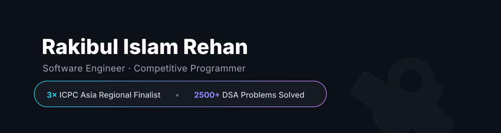

<!-- Temporary Banner -->

  

#  About Me
🎓 CSE graduate  
🏆 **3× ICPC Asia Dhaka Regional Finalist**   **| 2500+ solved problems (DSA focused)**  
📊 **Codeforces:** Specialist (Peak 1454)  
⭐ **CodeChef:** ★★★ (Peak 1665)  

---

## Socials

---

# 💻 Tech Stack

### Programming Languages

---

###  Backend & APIs

---

### 🌐 Frontend & UI

---

### 📱 Mobile Development

---

### 🗄 Databases

---

### 🛠 Tools

---

### 🔝 Top Contributed Repo

---

## 

<b>✨ Always learning. Always building. Always improving. ✨</b>

If you like my work, feel free to ⭐ my repositories — it motivates me a lot!

<!-- Crafted for clarity, professionalism & clean design -->
